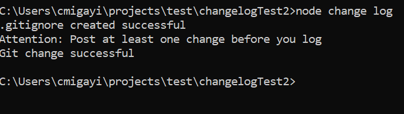

# changelog-gitter
Automated changelog generator for all projects including git add and commit. __Note: Your project doesn't have to be Node, to use this tool. You can use it with all projects__.

## Good to know
  __changelog-gitter__ takes care of your "git add ." and "git commit". You can confirm this by checking your git logs. 

## Pre-requisites
* NPM - Make sure you have NPM installed
* Git - Make sure you have Git installed 

## Installation
> npm init
 
__(Press Enter until all the defaults are accepted. The package.json file should be generate as a result).__

__Then, install changelog-gitter__
> npm i changelog-gitter --save

## Usage
1. Create a *change.js* file in your project root 

> touch change.js

__For windows: Create the file manual or use the following COMMAND:__
> echo > change.js

2. Paste the following onto *change.js* file

> require('changelog-gitter')

3. To use __changelog-gitter__ you should first initialize __Git__

> git init

## To test if the installation was successful, do this:
> node change log
 
__If the result is as follows then it was successful:__

__If the above image didn't show, click the one below__
(https://github.com/cmigayi/changelog-gitter/blob/master/changeloggittersuccessfulInstallation.PNG)

## The commands you will need:
4. You should know the following arguments: 

  * node change [log]
  
    Use this after posting atleast one change. It will generate the __CHANGELOG.md__ file in your project 
    
    > node change log
  
  * node change [VERSION_TYPE] [CHANGE_TYPE] ["COMMENT"]
  
    This is the format you use to post changes to the changelog file.
  
    i. [VERSION_TYPE]
    
      * Patch: Applicable when making bugs changes or updates. It will increment version at x (version: 1.0.x) 
      * Minor: Applicable when making minor changes in the project. It will increment version at y (version: 1.y.0)
      * Major: Applicable when making major changes in the project. It will increment version at z (version: z.0.0)
      
      Syntax
      > node change patch added "My first project patch change"
      
      > node change minor added "My first project minor change"
      
      > node change major added "My first project major change"
      
    
    ii. [CHANGE_TYPE]
      They preceed documentation comments. 
           
      * Added: Comment on any added feature
      
      > node change patch __added__ "new feature added" 
      
      * Changed: Comment on any change made in the project code
      
      > node change patch __changed__ "Feature x changed to y"
      
      * Depracted: Comment on any deprecated feature
      
      > node change patch __deprecated__ "Feature x is no longer in use for v2.2.0"
      
      * Removed: Comment on any removed feature
      
      > node change patch __removed__ "x and y has been removed"
      
      * Fixed: Comment on any fixed feature
      
      > node change patch __fixed__ "The lag on login has been fixed"
      
      * Security: Comment on any security feature created, updated or added
      
      > node change patch __security__ "X was added in the db transactions to secure the data"
    
    iii. ["COMMENT"]
    
      This is the documentation comment. It should always be in double-qoutes. 
      
   ## "alike" argument
  
   This argument is used when you want to post changes to the same version.
    
   Syntax:
    
   > node change patch __alike__ added "new change has been made" 
      
   
